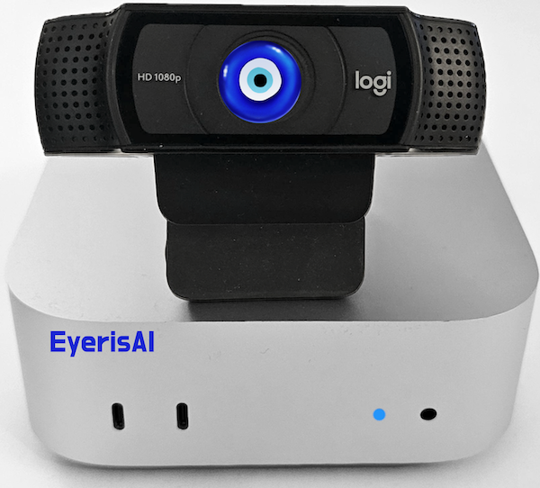
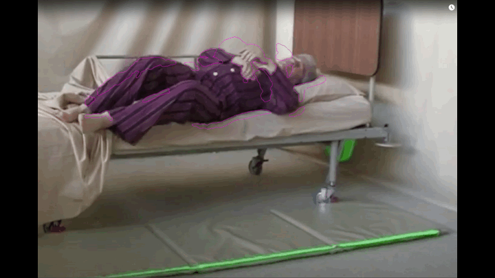
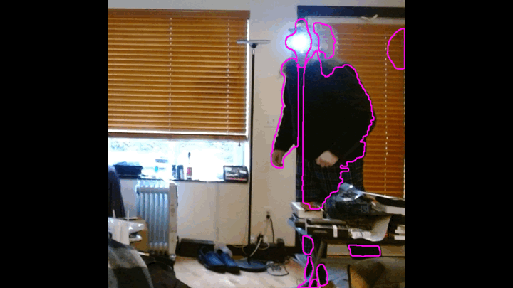

# EyerisAI 🧿
AI powered camera and event detection system

## What is EyerisAI?

EyerisAI (pronounced "IrisAI", 👁️+🤖) is a simple project to couple a standard computer, webcam, computer vision and multi-modal LLM (💻 + 📷 + 👁️ + 🤖) to create a visual system that can be configured to "watch" something for any events, and when an event is detected, have generative AI examine what's going on and log, speak out (TTS) and optionally send and alert (currently just email) describing the event. You configure a prompt to tell the AI what to look for and how to respond. It's essentially an AI enabled video camera. It's working in it's current state but still needs improvements, and in the future can possibly be improved to not only log, speak and send email alerts, but perhaps call webhooks, execute commands or take other actions such as interacting with your home automation system based on what it's seeing.

## Potential Use Cases


### Hospital Fall Detection




### Home Security 




## Install

Clone this repository to the system you want to run EyerisAI on:

```bash
git clone https://github.com/robert-mcdermott/EyerisAI.git
```

If you are using ***pip*** 

```bash
cd EyerisAI
pip install -r requirements.txt
```

Alternatively, if you are cool 😎, and are using ***uv***:

```bash
uv sync
```

## Configure

Edit the ***config.ini*** file to suit you needs. Here are some of the most likely variables you'll want to change:

Update the name of this camera, where it's located, what it's purpose it or something to identify it:

```ini
[General]
instance_name = Give this Camera a name 
```

Adjust the sensitivity of the motion detection. The **min_area** is the area size in pixels that needs to change to trigger. Smaller is more sensitive, larger is less. The **threshold** is the intensity of pixel value shifts required to trigger detection, smaller is more sensitive, larger is less. **cooldown** is the time to wait before another motion detection even can be triggered to prevent too many events.

```ini 
[MotionDetection]
min_area = 700
threshold = 50
cooldown = 3
```
If you have multiple cameras registered on your system, you may need to change the **device_index** to select the correct camera (this may require some trial and error to find the desired camera):

```ini
[Camera]
device_id = 0
```

If you want the system to speak aloud the AI's response (description of what it sees), change the **enabled** variable int the TTS section to *true*:

```ini
[TTS]
enabled = false
```

In the *AI* section, you select that LLM model that you want to use. If you want use a local model, make sure that ollama is install and that you have pulled the model that use want to use. "Moondream" is a good local model to start with. EyerisAI can work with any OpenAI compatible API (like LiteLLM Proxy) and multi-modal LLM. The *prompt* variable is important, that's were you provide the AI with instructions what you want the AI to examine in the image, or how to act, respond. 

```ini
[AI]
# Ollama model and endpoint
model = moondream
base_url = http://localhost:11434
# Any OpenAI compatible API endpoint:
#model = gpt4o
#base_url = https://api.openai.com/v1
api_key = sk-12345
prompt = You are a home security camera that has detected motion. The areas where motion was detected are indicated with magenta contours. Examine the image and report what activity you see, especially any humans visible.
```

There are other things that can be configured or adjusted, such as sending emails, that aren't covered here but should be self explanatory.

## Running 

Now that all the dependencies are satisfied and you have adjusted the configuration to your specific use case.

To run via Python:

```bash
python EyerisAI.py
```

Or for the cool 😎 ***uv*** folks:

```bash
uv run EyerisAI.py
```

## Output

The images where motion was detected are PNG images named after their date-time stamp and located in the ***captures** directory in the project folder.

The detection log that captures details about the even, such as the date/time, model that was used and the AI generated description of the image event are in JSONL format and are available in the ***'captures/motion_events.jsonl'*** file.

