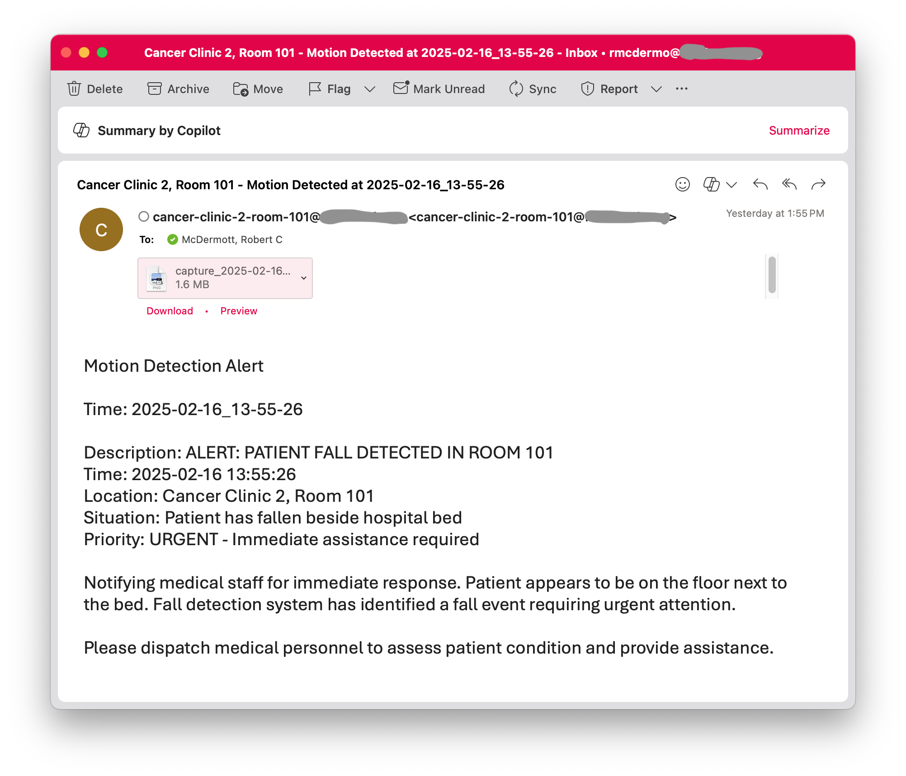
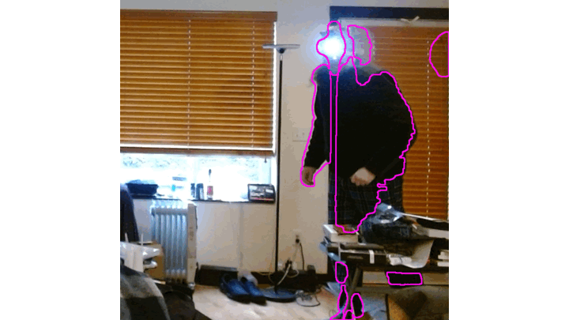
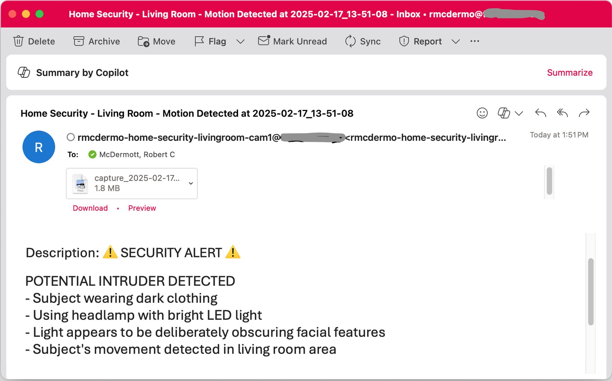

# EyerisAI 🧿
AI powered camera and event detection system

## What is EyerisAI?

EyerisAI (pronounced “IrisAI,”, 👁️ + 🤖) is a project to create an AI-powered camera and event detection system that uses a computer, webcam, computer vision, and a multi-modal LLM (💻 + 📷 + 👁️ + 🤖) to “watch” for specific events in real time. When it detects an event, EyerisAI uses generative AI to analyze the scene, log the findings, and respond, either by speaking aloud (TTS) or sending an email alert. You simply configure a prompt that tells the AI what to look for and how to react.

The projects is currently functional but still evolving, EyerisAI can be made more versatile in the future, potentially integrating with webhooks, running commands, or interacting with home automation systems. Think of it as an intelligent, customizable surveillance tool that not only watches but actively interprets and responds to what it sees.

## Potential Use Cases

There are many potential applications of an AI enabled camera system. You're imagination is the limit. Here are some potential focus areas and their use cases:

**Healthcare Monitoring**
 - Patient fall detection in medical facilities
 - Elder care movement monitoring
 - Behavioral health observation
 - Emergency response triggering

**Security Applications**
- Intelligent home surveillance
- Business premises monitoring
- Weapon detection
- Suspicious activity alerts

**Family Care**
- Smart baby monitoring
- Child safety oversight
- Pet behavior tracking
- Elderly care assistance

**Professional Monitoring**
- Workplace safety compliance
- Construction site supervision
- Equipment monitoring
- Quality control observation

**Research & Analysis**
- Wildlife observation
- Experimental observation and logging


## Examples

### Hospital Fall Detection


Email Alert example:



### Home Security 



Email Alert example:



## Install

Clone this repository to the system you want to run EyerisAI on:

```bash
git clone https://github.com/robert-mcdermott/EyerisAI.git
```

If you are using ***pip*** 

```bash
cd EyerisAI
pip install -r requirements.txt
```

Alternatively, if you are cool 😎, and are using ***uv***:

```bash
uv sync
```

## Configure

Edit the ***config.ini*** file to suit you needs. Here are some of the most likely variables you'll want to change:

Update the name of this camera, where it's located, what it's purpose it or something to identify it:

```ini
[General]
instance_name = Give this Camera a name 
```

Adjust the sensitivity of the motion detection. The **min_area** is the area size in pixels that needs to change to trigger. Smaller is more sensitive, larger is less. The **threshold** is the intensity of pixel value shifts required to trigger detection, smaller is more sensitive, larger is less. **cooldown** is the time to wait before another motion detection even can be triggered to prevent too many events.

```ini 
[MotionDetection]
min_area = 700
threshold = 50
cooldown = 3
```
If you have multiple cameras registered on your system, you may need to change the **device_index** to select the correct camera (this may require some trial and error to find the desired camera):

```ini
[Camera]
device_id = 0
```

If you want the system to speak aloud the AI's response (description of what it sees), change the **enabled** variable int the TTS section to *true*:

```ini
[TTS]
enabled = false
```

In the *AI* section, you select that LLM model that you want to use. If you want use a local model, make sure that ollama is install and that you have pulled the model that use want to use. "Moondream" is a good local model to start with. EyerisAI can work with any OpenAI compatible API (like LiteLLM Proxy) and multi-modal LLM. The *prompt* variable is important, that's were you provide the AI with instructions what you want the AI to examine in the image, or how to act, respond. 

```ini
[AI]
# Ollama model and endpoint
model = moondream
base_url = http://localhost:11434
# Any OpenAI compatible API endpoint:
#model = gpt4o
#base_url = https://api.openai.com/v1
api_key = sk-12345
prompt = You are a home security camera that has detected motion. The areas where motion was detected are indicated with magenta contours. Examine the image and report what activity you see, especially any humans visible.
```

There are other things that can be configured or adjusted, such as sending emails, that aren't covered here but should be self explanatory.

## Ollama

If you will be running the AI inference locally on the system with the camera and running EyerisAI, you'll need to first have Ollama running with the models that you'll be using downloaed. I'm not going to cover this in detail here but, I provide detailed instructions in my article ["LLM Zero-to-Hero with Ollama"](https://blog.cubed.run/llm-zero-to-hero-with-ollama-913e50d6b7f0) 

## Running 

Now that all the dependencies are satisfied and you have adjusted the configuration to your specific use case.

To run via Python:

```bash
python EyerisAI.py
```

Or for the cool 😎 ***uv*** folks:

```bash
uv run EyerisAI.py
```

## Output

The images where motion was detected are PNG images named after their date-time stamp and located in the ***captures** directory in the project folder.

The detection log that captures details about the even, such as the date/time, model that was used and the AI generated description of the image event are in JSONL format and are available in the ***'captures/motion_events.jsonl'*** file.

